# 电脑室学生积分管理系统 · 系统设计 v1.1

本文是实现依据。v1.0 曾写在 Claude Code 会话里，没有落盘。v1.1 回写了已确认的收尾决定，并改正两处与需求冲突的规则：座位编号顺序、换座重叠轮换。

配套文档：

| 文档 | 内容 |
|---|---|
| `docs/SCHEMA.md` | 目标库表、主外键、索引 |
| `docs/API.md` | 接口、错误码、请求体与响应体 |
| `docs/DEPLOY.md` | 部署、备份、恢复、匿名化补做 |
| `docs/DEVIATIONS.md` | 本文与当前代码、迁移的差异 |
| `docs/使用教程.md` | 给教师的操作说明。页面还没有入口的准备步骤也写在那里 |
| `需求文档.md` | 需求基线 v1.0 |
| `migrations/001_phase1_core.sql` | 第一阶段表 |
| `migrations/002_phase2_duty_marks.sql` | 第二阶段卫生轮次、普通标记、点名与倒计时表 |
| `migrations/003_term_open_return_new.sql` | 已发布迁移后的学期触发器修正 |

## 0. 已确认决定

这些条目已经拍板，不再作为开放问题。

| 主题 | 决定 |
|---|---|
| 并列破序 | 最近一次积分变化后达到当前分数的时间。从 10 降到 8 再回到 10，用回到 10 的那次。同一批次共享同一时间，再按班级、学号稳定排序 |
| 回放检查点 | 每 200 个回放事件触发一次，另加每日兜底。后台异步生成，不进入加减分事务。200 是可调参数。当前榜单直接读 `point_balance` |
| 匿名化清单 | 只存内部学生 ID、匿名代号、匿名化时间、处理版本。不存姓名、学号，也不存姓名哈希。追加写入，存放位置和加密密钥都独立于数据库备份。导出失败要告警并重试。恢复旧备份后，先补做后续匿名化，再开放访问 |
| 手机换座 | 选择学生 → 选择目标锚点 → 预览并确认。首版不做拖拽。预览包含受影响但未选中的学生。越界或缺少目标机位则禁止提交 |
| 学期 | 一次性全局切换，所有班级同时进入新学期 |
| 离班 | 状态转移，不删数据。二次确认。离班后不出现在当前榜单和点名池，可以恢复 |
| 卫生预览 | 同一班同一轮同时只有一个未确认抽选。取消只关闭预览，再次打开仍是原结果 |
| 高可用 | 不在范围内。目标是一台 2C4G 上的单进程 + 单库 + 每日备份 |

## 1. 设计公理

| # | 公理 | 落地 |
|---|---|---|
| A1 | 座位编号是显示属性，不是标识 | 引用用 `seat_id`。快照成对保存 `seat_id` + `seat_number_snapshot` |
| A2 | 编号由一次全局重排生成，结果连续、无空洞 | `renumerate()`，见 §3.1。历史快照不回溯 |
| A3 | `direction` 是列的持久化属性，表示该列编号的行走方向 | `toward_back`：讲台→后墙；`toward_front`：后墙→讲台 |
| A4 | 学生朝向是列级 `facing` | `right` = 朝机房屏幕左侧（①③）；`left` = 朝屏幕右侧（②④）。姓名和分数始终正向 |
| A5 | 账本只追加 | 撤销 = 插入反向明细并双向关联 |
| A6 | 一次批量 = 一个批次，整体成功或整体失败 | 同批次共享同一 `occurred_at` 和同一个回放事件序号 |
| A7 | `request_id` 全局唯一 | 同键同体返回原结果 200；同键不同体 409 |
| A8 | 回放 = 事件序列 + 检查点 | 累计分起点随区间滑动；净增减从 0 起 |
| A9 | 卫生与学期、积分解耦 | 轮次不引用 `term_id`。卫生操作不写账本 |
| A10 | 每条卫生线最多一个未结束轮次；该轮最多一个未确认抽选 | 唯一索引。未确认包含 `pending` 和 `cancelled` |
| A11 | 离班是状态转移 | `active → left`，可恢复。匿名化是另一条不可逆转移 |
| A12 | 写入以服务端校验为准，携带 `expected_version` | 版本过期 409，不静默合并 |

技术栈：React 18 + TypeScript + Vite；Node 22 + Fastify + Zod；Drizzle + 手写 SQL 迁移；PostgreSQL 16；SSE；Nginx + Docker Compose。

## 2. 架构

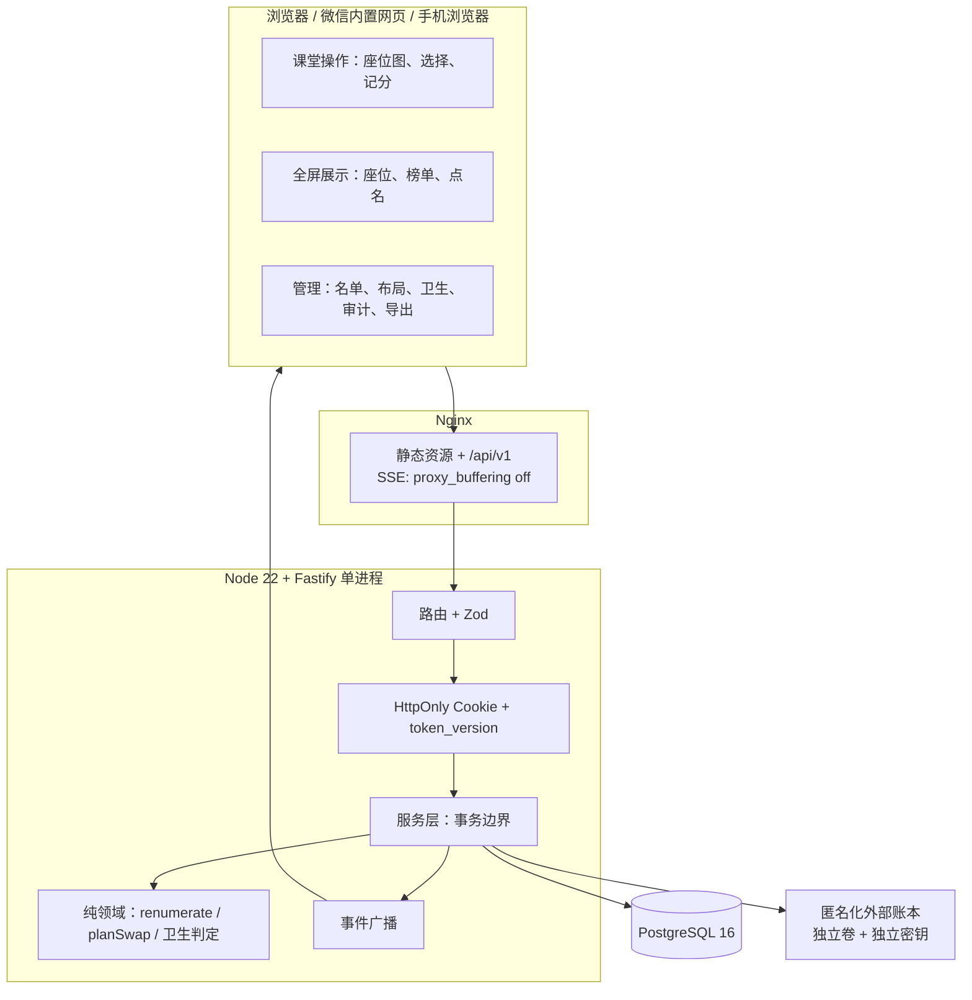

部署是三容器：`nginx`、`api`、`postgres`。Postgres 只在 Compose 网络内暴露 5432，不映射宿主机端口。一台机器，不做多副本。

模块边界：

| 层 | 职责 |
|---|---|
| `src/domain` | 无 I/O。编号、换座、积分可撤销性、卫生候选资格 |
| `src/repo` | SQL。事件行只写入 `event_log` |
| `src/services` | 事务、幂等、审计，并在提交后登记 SSE |
| `src/server.ts` | Fastify HTTP 路由、Cookie 与 Zod 入参解析 |
| `web` | 草稿和动画留在浏览器；提交结果以服务端为准 |

三层正交数据：

| 层 | 范围 | 生命周期 |
|---|---|---|
| 机位 `room_slot` | 全校一套 | 永久。`seat_id` 不复用 |
| 座次 `seat_assignment` | 每班一份 | 跨学期延续 |
| 积分账本 | 每学期从 0 起 | 旧学期只读 |

卫生轮次是第四条独立时钟，可跨学期延续。

## 3. 关键算法

### 3.1 `renumerate()`

几何约定：

- 讲台在图上方，门在右侧。屏幕从左到右是 ④③②①。
- `display_order`：1 = ④（最左）… 4 = ①（最右）。只决定画布从左到右的列序。
- `sort_in_column`：1 = 讲台端，数值增大指向后墙。这是物理槽位，插入或删除时重排槽位序号，不把槽位序号当作编号。
- 编号遍历列的顺序是 ① → ② → ③ → ④，也就是 `display_order` **降序**。

列内：

| `direction` | 行走 | 初始列 |
|---|---|---|
| `toward_back` | `sort_in_column` 升序，讲台 → 后墙 | ①、③ |
| `toward_front` | `sort_in_column` 降序，后墙 → 讲台 | ②、④ |

```
columns := 按 display_order 降序          # ① → ② → ③ → ④
n := 1
for col in columns:
    slots := col.slots
    if col.direction = toward_back:
        order := slots 按 sort_in_column 升序
    else:
        order := slots 按 sort_in_column 降序
    for s in order:
        s.seat_number := n
        n := n + 1
```

初始 54 座的结果：

| 列 | 座位数 | direction | facing | 编号 | 讲台端的号 |
|---|---:|---|---|---|---|
| ① | 14 | toward_back | right | 1–14 | 1 |
| ② | 14 | toward_front | left | 15–28 | 28 |
| ③ | 13 | toward_back | right | 29–41 | 29 |
| ④ | 13 | toward_front | left | 42–54 | 54 |

`001` 的列种子已经是这组 `direction` / `facing`。迁移不写 `seat_number`；当前 `scripts/migrate.ts` 在 `migrate up` 后调用符合本节的函数自动回填。

在③列、④列的后墙端各插入一座之后：

| 列 | 结果 |
|---|---|
| ①② | 仍是 1–14、15–28 |
| ③ | 29–42。新座在后墙端，编号 42 |
| ④ | 43–56，仍是后墙 → 讲台。新座在后墙端，编号 43；原 42–54 顺延为 44–56 |

触发时机：插入、移动、删除机位，或修改列 `direction`。与布局变更同一事务。事务中间 `seat_number` 允许暂时为空。历史 `seat_number_snapshot` 不更新。

删除机位前扫描全部班级的 `seat_assignment`。仍有人占用则拒绝，并返回占用班级。

`facing` 只影响椅背和电脑图标画在卡片左侧还是右侧。姓名、分数不旋转。

### 3.2 `planSwap()`

手机与电脑共用这一套判定。手机用三步收集两个集合，电脑可以用拖拽收集同样的两个集合。服务端不接受“偏移量”，只接受学生集合和目标座位集合。

手机收集方式：

1. 选择学生。
2. 选择锚点座位，表示座位号最小的那名已选学生要去的座位。
3. 其余学生使用与该生相同的列偏移和槽位偏移。任一目标机位不存在，预览阶段就禁止提交。

设 `Ss` 为选中学生，`Ts` 为目标座位。

```
P1  |Ss| = |Ts| ≥ 1，每个学生当前有座，每个目标座位存在
P2  允许 Ss 的座位与 Ts 部分重叠或完全重叠

主分配（保持相对顺序）：
  src := Ss 按当前 seat_number 升序
  tgt := Ts 按 seat_number 升序
  src[i] → tgt[i]

被波及的未选中学生：
  vacated := 选中学生的座位 \ Ts
  outsiders := Ts 上的占用者 \ Ss
  两组都按 seat_number 升序
  outsiders[j] → vacated[j]
```

`|Ss| = |Ts|` 时，腾出的座位数等于目标区里不属于来源区的座位数，因此未选中的占用者一定有位子。多出来的腾出席位变为空座。

拒绝条件只包括：人数不相等、学生不在座、目标座位不存在、目标集合里有重复。部分重叠本身可以提交。

例：1 号 A、2 号 B、3 号空。只选 A，目标为 2 号。结果是 A→2、B→1。B 出现在预览的“受影响但未选中”里。

例：同布局，选 A 和 B，目标为 2 号和 3 号。结果是 A→2、B→3，1 号空出。这是重叠移动链，应当成功。

提交在一个事务里写入全部主分配和被波及分配，携带 `expected_version`。取消草稿不产生服务端写入。

### 3.3 积分与并列

- 分数是整数，可以为负。单次变动是非零整数。
- 模板有固定正负方向。当次可以改绝对值，不能反转方向。班级覆盖是字段级的：名称、默认分值、隐藏。未覆盖字段跟随全局。历史明细保存当时的原因快照。
- 可以不选原因。快捷值 `+1 +2 -1 -2`。
- 单人立即提交。批量先展示人数、分值和原因，再确认。
- 撤销插入反向明细。已撤销明细不能再冲销。整批撤销只冲销该批里仍然有效的明细。
- 只能使用服务器提交时间。旧学期禁止写入，包括禁止把反向明细记到新学期。
- `point_balance.last_change_seq` 存的是该批次对应的回放事件序号，不是每一条明细各自的序号。同一批次的人因此并列破序时间相同，再按班级名、学号排序。
- 当前榜：`balance DESC, last_change_seq ASC, class_name, student_no`。名次按 `1, 1, 3` 跳号。离班和已匿名化的学生不在当前榜。

### 3.4 回放

一个积分批次算一个回放事件。入班、离班、恢复、匿名化也算回放事件。卫生、倒计时、点名不算。

| 模式 | 起点 | 柱高 |
|---|---|---|
| `cumulative` | 区间开始前已经拥有的分数 | 当时累计分。负分画在零线左侧 |
| `net` | 0 | 区间内净增减 |

播放时每一帧取当时的在班集合：离班前仍在，离班后退出。匿名化学生显示匿名代号。Top10 按与榜单相同的规则截取，跟踪的是当时的前十名。同一批次是一帧，不拆成逐人先后。

检查点：

- 计数对象是 `event_log.replay_relevant = true` 的事件。
- 每累计 200 条，后台任务为每个班、当前学期写一条 `replay_checkpoint`。阈值放在 `job_config`，初始值 200。
- 每日 `07 3 * * *` 再写一条兜底。与备份 `17 2 * * *` 错开。
- 生成在加减分事务之外。加减分只插入事件。
- 拖动时间轴时，取不晚于该时刻的最近检查点，再重放其后的事件。
- 最新检查点之后的事件按需补算。

## 4. 卫生管理员

卫生管理员不是普通标记。打图标不能改变任职。卡片用扫帚图标和琥珀色，显示 `完成次数/应完成次数`。选中态用另一套颜色。

### 4.1 对象

| 对象 | 含义 |
|---|---|
| `duty_line` | 每班一条活跃线 |
| `duty_term` | 一次任职。默认 `0/3`。重复任职新开一条，`seq_no` 递增 |
| `duty_round` | 一次检查。`members_snapshot` 冻结开轮时的原管理员 |
| `duty_round_member` | 本轮每个人的勾选状态 |
| `duty_candidate` | 冻结后的不放回候选池 |
| `duty_selection` | 一次抽选。预览时就把结果写入 `duty_selection_item` |
| `duty_obligation_adjust` | `1/3 → 1/4` 的留痕，同一任期同一轮唯一 |
| `duty_action_log` | 全部卫生操作的前后状态 |

轮次阶段由数据推导：

| 阶段 | 条件 |
|---|---|
| `marking` | `status = in_progress` 且 `frozen_at` 为空 |
| `substituting` | `status = in_progress` 且 `frozen_at` 已填 |
| `closed` | `status = closed` |

`frozen_at` 和 `version` 在 `duty_round` 上，见 `docs/SCHEMA.md`。

新任期在确认当轮写入，`started_round_id` 先为空，表示下一轮才生效。下一轮 `start` 时，把这些空值填成新轮次 id。本轮成员行 `is_original = false`，不进入候选池，不计完成次数。界面把他们放在“下一轮新任人员”。

### 4.2 状态表

严格顺序是：登记与计次 → 达标退役 → 冻结候选 → 抽选替补。计次阶段里的退役在勾选打扫时立即发生。冻结读取的是退役之后的在任集合。

| 操作 | 允许阶段 | 效果 | 拒绝 |
|---|---|---|---|
| 开始轮次 | 该线没有未结束轮次 | 写入快照；原管理员各一行，`is_original = true`，`eligible_for_backfill = true` | 已有未结束轮次 |
| 登记再次未推椅子 | `marking` 或 `substituting` | 原管理员 `no_push = true`，`eligible_for_backfill = false`。任期和已完成次数保留。若已在冻结池中，移出池；若已被抽中且抽选未确认，该抽选改为 `invalidated` | 非原管理员；本轮已经登记过 |
| 勾选实际打扫 | `marking`；`substituting` 时视为纠正 | 原管理员 `attended = true`，`counted_round = true`，`completed_count + 1`。达到应完成次数则立即 `retired`，不占替补名额。同轮同人只计一次 | 非原管理员；本轮已经计次 |
| 确认应值日未参加 | `marking` 或 `substituting` | `required_count + 1`，写 `duty_obligation_adjust`。`attended` 保持 false，`eligible_for_backfill = false`。不增加完成次数 | 本轮已加过一次；已经计次的人走纠正，不走这条 |
| 冻结候选 | `marking` | 写入 `frozen_at`。候选 = 原管理员 ∧ 已打扫 ∧ 任期仍为 `active` ∧ `eligible_for_backfill`。空池也冻结成功 | 已经冻结过：返回原池，不重新计算 |
| 录入新发现的未推椅子学生 | `substituting`，且该轮没有 `pending` 或 `cancelled` 的抽选 | 见下方分支 | 尚未冻结；已有未确认抽选；该生已在任；该生是本轮新任 |
| 再次打开预览 | 抽选为 `pending` 或 `cancelled` | 返回原 `duty_selection_item` | — |
| 取消预览 | `pending` | `status = cancelled`。明细保留，候选仍标记为已被该抽选占用 | — |
| 重新打开已取消的预览 | `cancelled` | 回到 `pending`，明细不变 | — |
| 确认 | `pending` | 被抽中的原管理员 `retired`。新学生插入任期 `0/3`，`started_round_id` 为空。抽选改为 `confirmed` | 非 `pending`。重复确认返回原结果 |
| 关闭轮次 | `marking` 或 `substituting` | `status = closed`。未确认抽选必须先确认、取消后仍未处理的不能关轮：存在 `pending` 或 `cancelled` 时拒绝 | 有未确认抽选 |
| 人工纠正 | 任何未结束轮次，关轮后仍允许纠正历史任期，但不再改本轮池 | `release` / `restore` / `adjust_count`。写前后状态。若被纠正的人是未确认抽选的结果，抽选改为 `invalidated`，并释放其候选占用 | 用抽签代替纠错：没有“重抽同一预览”的接口 |

录入学生时的分支：

| 条件 | 结果 |
|---|---|
| 冻结池里还有未被占用、未被作废的候选 | `crypto.randomInt` 抽一人，写入明细，抽选为 `pending`。该候选立刻记 `consumed_by_selection_id`。预览文案是“拟由某原管理员接替该生” |
| 池为空，或剩余候选都已占用或作废 | 不产生待确认预览。直接插入新任期 `0/3`，`started_round_id` 为空，抽选一行 `confirmed`，`resolution_note = no_candidate` |

失效规则：

- 冻结之后，后来才变得有资格的人**不**加入本轮池。
- 冻结之后失去资格的人，从剩余池移除。若未确认抽选抽中的正是此人，抽选改为 `invalidated`，响应里说明原因。
- `invalidated` 之后才能为**另一个**新学生再抽，或对同一新学生重新抽选。重新抽选是新的 `selection_id`，因为旧结果已经作废。
- `cancelled` 仍占用“一轮一个未确认抽选”的名额，也继续占用被抽中的候选。这样取消后再打开不会换人，也不能趁取消去抽另一个人。

普通课堂缺席只进点名排除名单，不调用卫生接口。

离班会结束该生进行中的任期，记原因，并按上表触发失效。

卫生任何操作都不写 `point_entry`。

### 4.3 已经写入 `002` 的列与索引

`migrations/002_phase2_duty_marks.sql` 的 `duty_round` 已包含 `frozen_at` 和 `version`。未确认抽选的唯一索引覆盖 `pending` 与 `cancelled`。若某个环境曾经执行过没有这两列的旧脚本，用下面的语句补齐，不要再执行一遍整份 `002`。

```sql
ALTER TABLE duty_round
  ADD COLUMN IF NOT EXISTS frozen_at timestamptz,
  ADD COLUMN IF NOT EXISTS version int NOT NULL DEFAULT 1;

DROP INDEX IF EXISTS uq_selection_single_pending;
CREATE UNIQUE INDEX uq_selection_single_open
  ON duty_selection (round_id)
  WHERE status IN ('pending', 'cancelled');

CREATE UNIQUE INDEX IF NOT EXISTS uq_selection_student_open
  ON duty_selection (round_id, new_student_id)
  WHERE status <> 'invalidated';
```

`version` 供卫生写操作的 `expected_version` 使用，与班级 `seat_version` 分开。每次改变轮次可见状态时加 1。

`consumed_by_selection_id` 在创建 `pending` 时写入，不等到确认。确认失败或作废时清空，使该候选回到池中。`cancelled` 不清空。

## 5. 数据模型

目标库表、字段、主外键和索引的完整 DDL 在 `docs/SCHEMA.md`。`migrations/001_phase1_core.sql` 与 `migrations/002_phase2_duty_marks.sql` 是它的可执行副本。卫生轮次的 `frozen_at`、`version`，以及“未确认抽选”唯一索引，已经写进 `002` 和 `SCHEMA.md`。

```mermaid
erDiagram
    teacher ||--o{ session : has
    class ||--o{ student : contains
    class ||--o{ seat_assignment : assigns
    term ||--o{ seat_assignment : scoped
    room_column ||--o{ room_slot : holds
    room_slot ||--o{ seat_assignment : occupied_by
    student ||--o| seat_assignment : sits
    term ||--o{ point_batch : books
    point_batch ||--|{ point_entry : contains
    student ||--o{ point_entry : receives
    term ||--o{ point_balance : caches
    student ||--o{ point_balance : has
    class ||--o{ duty_line : runs
    duty_line ||--o{ duty_round : opens
    duty_line ||--o{ duty_term : appoints
    duty_round ||--|{ duty_round_member : snapshots
    duty_round ||--o{ duty_candidate : freezes
    duty_round ||--o{ duty_selection : draws
    duty_selection ||--|{ duty_selection_item : persists
```

索引策略：

| 目的 | 索引 |
|---|---|
| 全局只有一个当前学期、一个开放学期 | `term` 上两个部分唯一索引 |
| 在班学号班内唯一，离班后学号可再用 | `student (class_id, student_no) WHERE status = active` |
| 显示编号唯一，重排事务中允许暂时为空 | `room_slot (seat_number) WHERE seat_number IS NOT NULL` |
| 一人一座、一座一人 | `seat_assignment` 主键 `(class_id, seat_id)`，唯一 `(class_id, student_id)` |
| 当前榜排序 | `point_balance (term_id, balance DESC, last_change_seq, student_id)` |
| 时间线与回放按序号扫描 | `point_entry (term_id, seq)`、`(class_id_snapshot, seq)`；`event_log (event_seq) WHERE replay_relevant` |
| 检查点就近查找 | `replay_checkpoint (class_id, term_id, upto_event_seq DESC)` |
| 一条明细只能冲销一次 | `reverses_entry_id`、`reversed_by_entry_id` 两个部分唯一索引 |
| 幂等 | `idempotency.request_id` 主键；`point_batch.request_id` 唯一 |
| 每条卫生线一轮、一轮一个未确认抽选 | `duty_round` 与 `duty_selection` 的部分唯一索引。`cancelled` 与 `pending` 一同占用名额 |
| 审计按对象回放 | `audit_log (entity, entity_id, created_at DESC)` |

切学期事务：关闭旧学期，打开新学期，为全部在班学生插入余额 0，写 `term_switched`。座次、普通标记、未结束卫生任期和未结束轮次不动。

导入：预览不落业务表，发 `preview_token`（内容哈希 + 当时的 `seat_version`，15 分钟）。提交时版本或哈希不符则 409，整单不写。文件内重复学号、占座冲突、座位不存在、超员、匹配到离班或已匿名学生、班内存在无座在班学生，都是整单拒绝。文件未出现的学生保留。

## 6. 一致性

| 场景 | 做法 |
|---|---|
| 余额与账本 | 同一事务写明细和 `point_balance`。维护命令按账本重算并比对 |
| 换座、导入、布局、切学期 | `SELECT … FOR UPDATE` + `expected_version` |
| 卫生抽选 | 行锁轮次 + 部分唯一索引 + `request_id` |
| 不放回 | `consumed_by_selection_id` 部分唯一 |
| 断网 | 页面保留已加载内容，标记离线，禁止写。重连后用 `Last-Event-ID` 补事件。首版不保证断网后重新打开页面 |
| 幂等 | 前端复用同一个 `request_id`；在途按钮禁用；300–500ms 防抖只合并同一次点击的重复派发 |

积分追加可以按事件序号顺序合并。换座、卫生、学期切换遇到 409 时，提示载入最新状态。

SSE 事件：`seat_changed`、`points_appended`、`roster_changed`、`layout_changed`、`term_switched`、`marks_changed`、`duty_round_changed`、`countdown_changed`、`rollcall_changed`、`resync`。序号过旧时发 `resync`，客户端改拉全量。

全屏展示是已登录页面的一种布局：显示座位号和姓名，隐藏备注和管理入口。不提供免登录链接。

## 7. 时序

### 7.1 导入

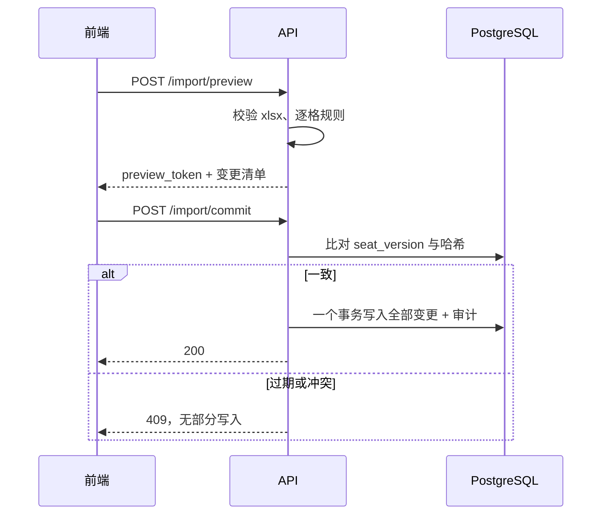

### 7.2 记账与撤销

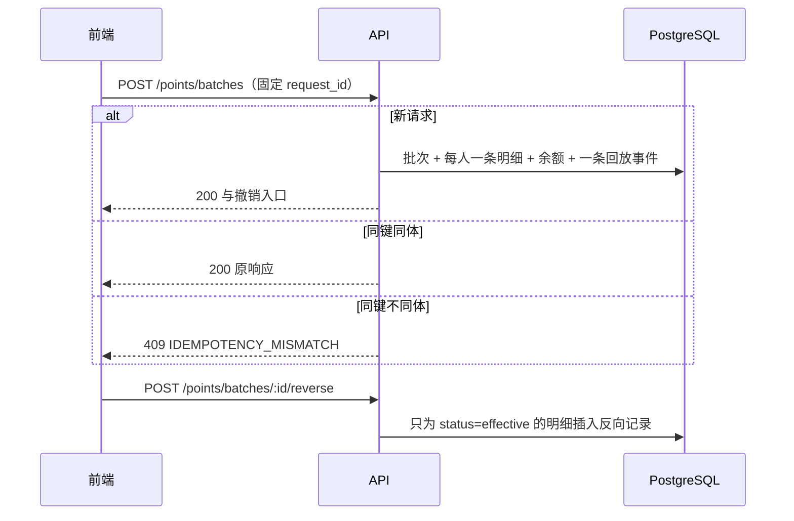

### 7.3 换座

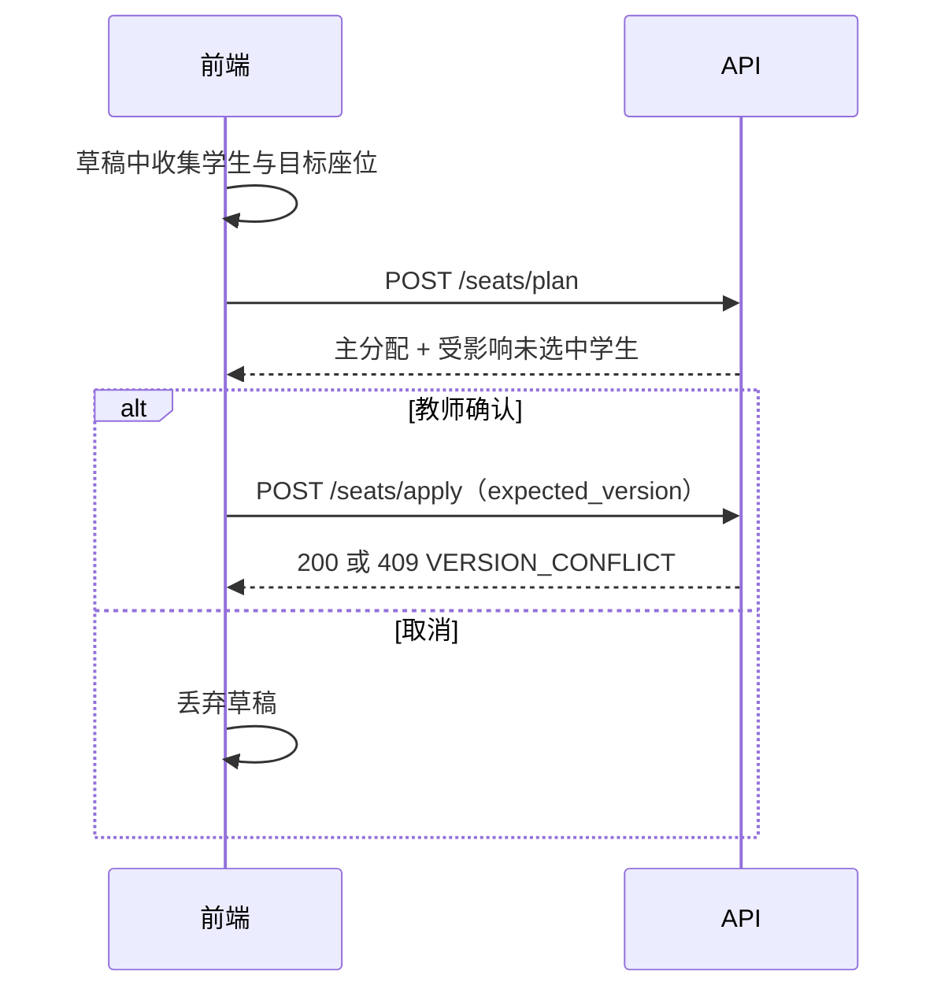

### 7.4 卫生替补

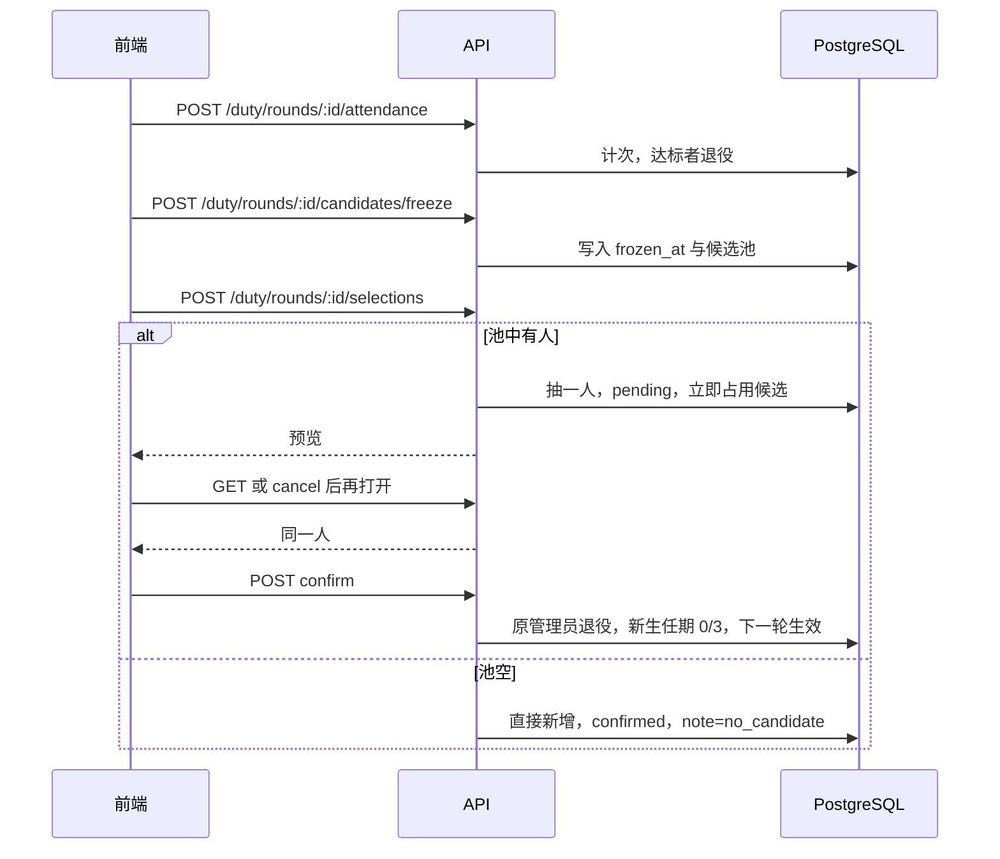

### 7.5 回放累计分

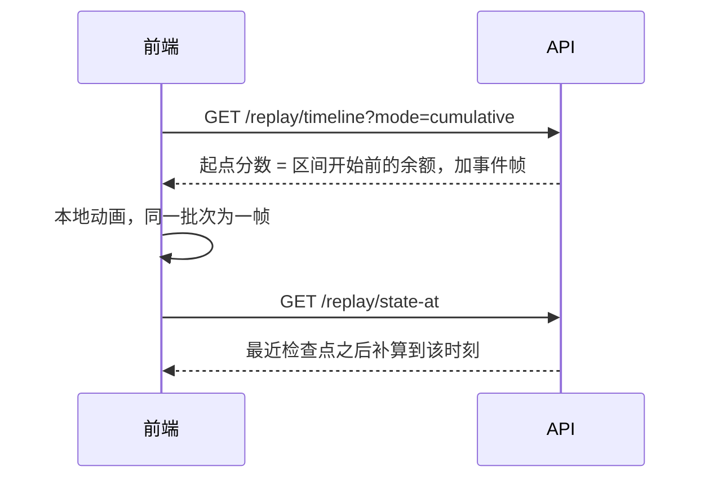

### 7.6 登录与踢出其他设备

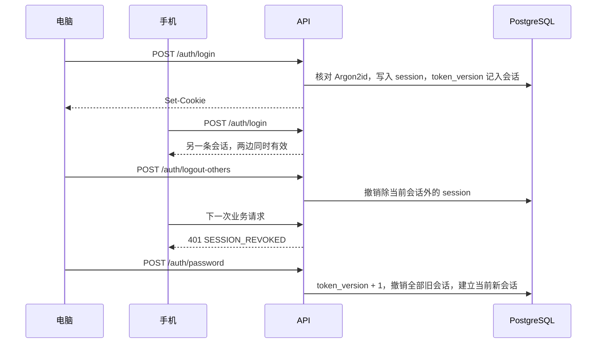

15 分钟内同一用户名或同一 IP 失败 5 次，返回 429 `RATE_LIMITED`，不写会话。

### 7.7 全局切换学期

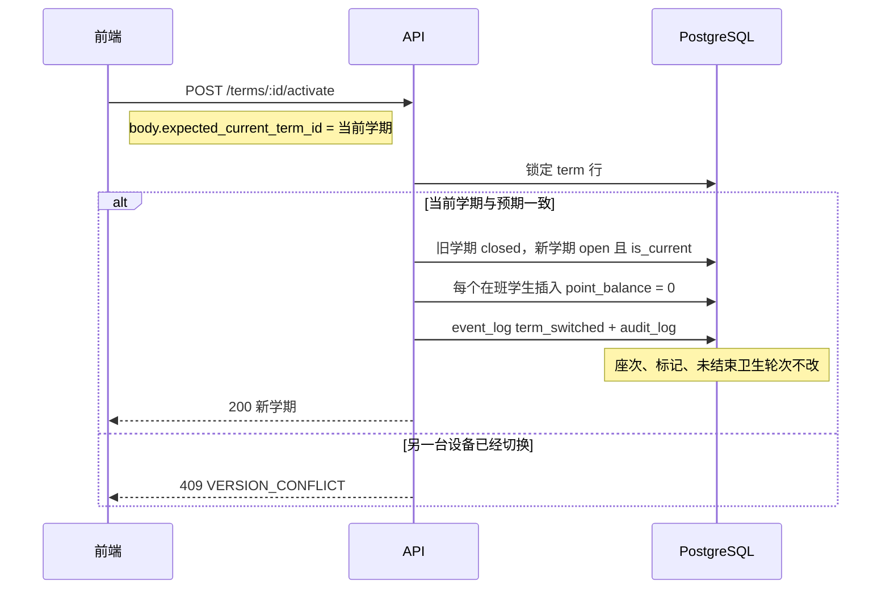

旧学期上的记账和撤销被 `assert_term_open()` 拒绝，错误码 `TERM_READONLY`。

### 7.8 布局变更与编号重排

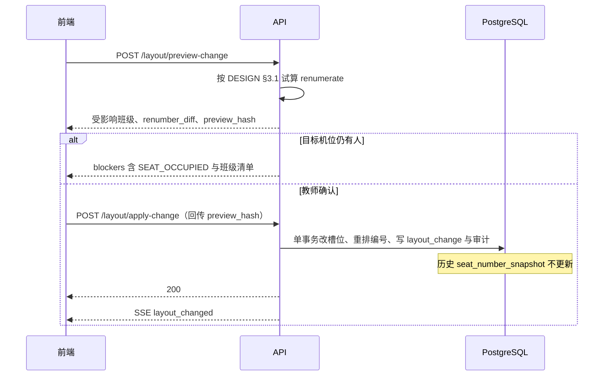

### 7.9 多端同步与版本冲突

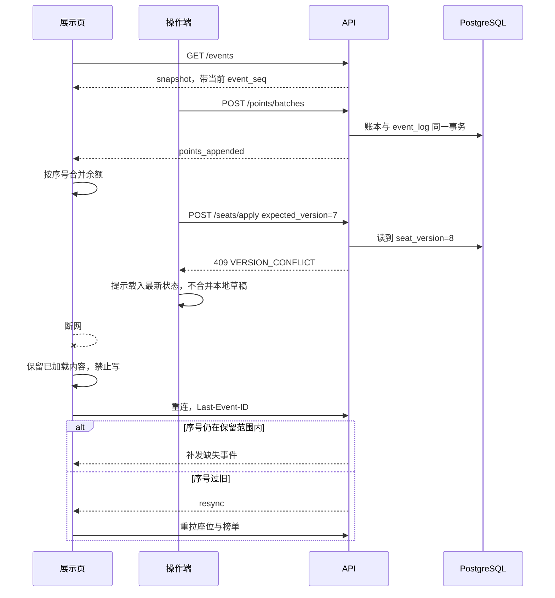

### 7.10 卫生义务、取消预览与纠正失效

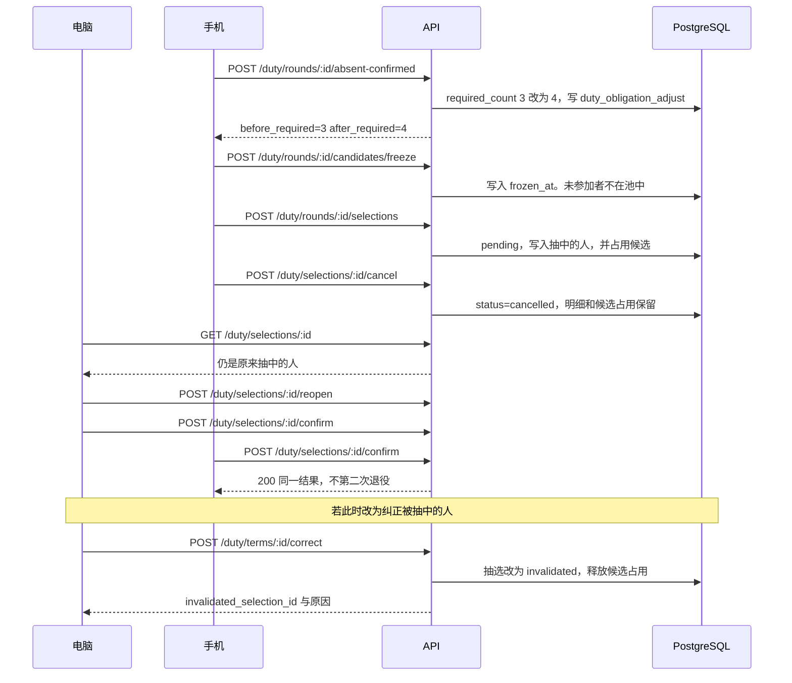

### 7.11 匿名化与恢复后补做

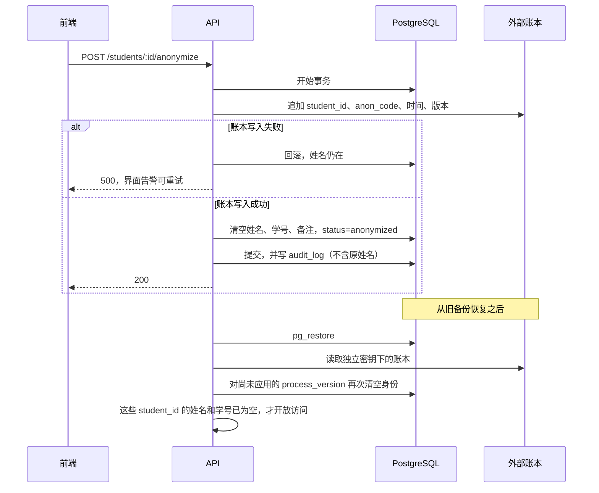

### 7.12 点名与倒计时

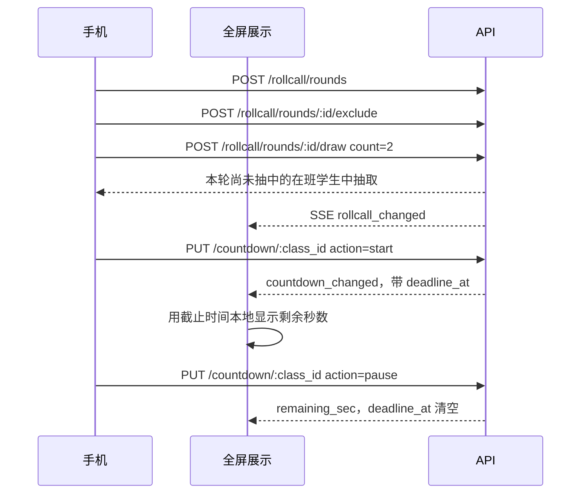

点名排除名单不调用卫生接口。倒计时不每秒推送。

## 8. 分阶段与验收

第一阶段：登录与踢出其他设备、班级与全局学期、双模板导入、布局与编号、换座、积分与撤销、时间线、审计、备份、SSE、手机三步换座。

第二阶段：普通标记、卫生状态机、榜单、回放、全屏、点名、倒计时、Excel 导出。

| 验收 | 落点 |
|---|---|
| 蛇形 54 座导入，冲突无部分写入 | §3.1 的初始编号 + 导入单事务 |
| 在班学生各占一座；删机位查全部班级 | 座次唯一约束 + 删除前扫描 |
| 重叠链、空座、列长不同、越界、取消 | §3.2。列长不够导致目标不存在则拒绝 |
| 单人、批量、无原因、负分、重复请求、部分撤销后整批撤销 | §3.3 |
| 切学期归零，座次和卫生延续，历史只读 | 切学期事务 + 触发器 |
| 双设备冲突、断网不写 | A12 + 离线状态 |
| 卫生四步，新任者不进本轮池 | §4.2 |
| 候选耗尽、取消不重抽、刷新继续、双设备确认、再次未推椅子、未值日加义务、人工纠正 | §4.2 状态表 |
| `1/3 → 1/4`，新任下一轮才计次 | `duty_obligation_adjust`，`started_round_id` 为空直到下一轮 |
| 回放并列、负分、整批、撤销、跨班、离班、匿名 | §3.4 |
| 导出与筛选一致，座位表可再导入 | 导出与列表共用查询；花名册导出使用行表模板 |

性能目标沿用需求：54 座交互反馈不超过 100ms，正常网络下提交和多端同步不超过 2 秒。容量不写死业务上限，用检查点和测试验证。
